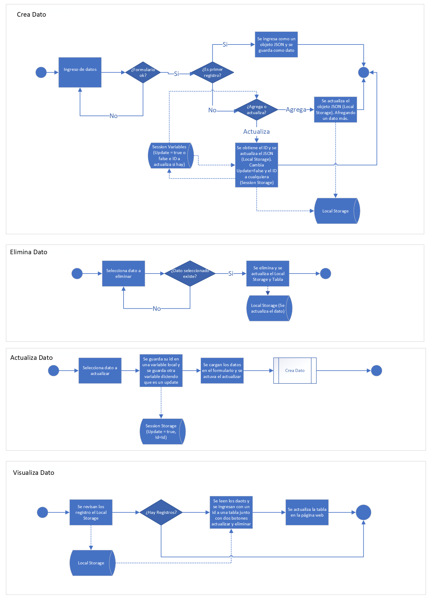

# CRUD - Proyecto 2 UDD - Bootcamp FullStack
## Página CRUD Simple

* [Info-General](#Info-General)
* [Objetivo](#Objetivo)
* [layout](#Layout)
* [Desarrollo](#Desarrollo)
* [Commits](#Commits)
* [Link](#Link)

## Info-General

El presente proyecto se enmarca en el programa FullStack y corresponde a la tarea N°2.

## Objetivo

Desarrollar una página web que permita ingresar datos, actualizarlos, visualizar y modificar.

## Layout

La página, como prototipo de layour está compuesto de la siguiente manera:
1. Navbar con un logo
2. Un Titulo simple
3. Un formulario donde se ingresa nombre, email, telefono y genero (todos como strng con el check solamente de que sea todo completado, excepto el genero)
4. Una tabla que se autocompletara con el formulario y en cada fila vendra la opción de eliminar y actualiza (se cargará en el formulario de arriba)
5. Un footer simple con un texto descriptivo

Visualmente la idea es que fuera algo asi (es solo un bosquejo inicial):

## Detalles del desarrollo

Se utilizaron variables locales para guardar los datos (un diccionario que es guardado en un array de objetivos y manipulado como JSON), y para el update variables de sesión. El flujo de proceso sería el siguiente en resumen:

## Comits del proyecto

Favor visitar el siguiente link: [link](https://github.com/guitarAlgorithman/Projecto-2-CRUD/commits)

## Link
La página del proyecto es la siguinte: [Pagina](https://guitaralgorithman.github.io/Projecto-2-CRUD/)